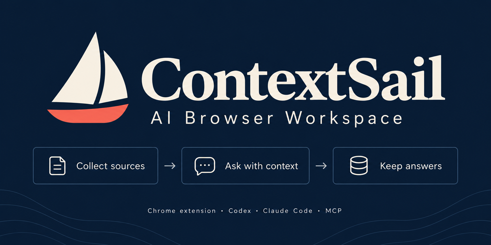

# ContextSail — AI Browser Workspace

> **Your sources. Your canvas. Your AI.** A local-first Chrome extension that combines a web clipper, infinite canvas, and MCP bridge for Codex and Claude Code. Turn scattered research into answers you can check and revisit.

[Simplified Chinese](README.zh-CN.md) · [Download](https://github.com/Amossse/contextsail-ai-browser-workspace/releases/latest) · [Setup](#quick-start) · [Privacy](PRIVACY.md)



[](LICENSE) [](docs/local-codex-setup.md) [](PRIVACY.md)

## Why ContextSail

Comparing several articles usually means copying passages into a chat and finding the originals again later. ContextSail keeps the material and the conversation together:

- Collect pages or selected passages with their source links.
- Select the material and ask Codex to summarize, compare, or answer a question.
- Return to the saved answer, check the original material, and ask a follow-up.

Board data stays in your browser by default. Content is sent to your local AI CLI only when you explicitly run a task.

## Quick start

New installations use English. Change **Language** in the extension popup or **More → AI and connections** to English or Simplified Chinese. Existing installations keep Chinese. Reopen pages after switching; active tasks and collected content are left unchanged. AI answers follow your question's language, not the interface language.

### 1. Install the extension

1. Download and unzip the [latest release](https://github.com/Amossse/contextsail-ai-browser-workspace/releases/latest).
2. Open `chrome://extensions` or `edge://extensions` and enable **Developer mode**.
3. Choose **Load unpacked**, select the extracted folder, and pin ContextSail.

You can now capture and organize content without Codex.

### 2. Capture your first item

On the page you want to save, open the extension and collect the page or selected text. Open a new tab and choose **Open Inbox** to find it, or **New Board** to organize a project. You can also paste content inside a board.

To keep an article's source, collect its text using the extension button or selection menu on the original page. Pasting a URL saves the link; it does not import the article body.

### 3. Ask about your material

Select your material and choose **Ask AI**. Connect Codex when you first want an answer; collection works without it.

Install and sign in to the [Codex CLI](https://developers.openai.com/codex/cli), then run this once from the extracted ContextSail folder:

```sh
./install.sh --core
```

Reload ContextSail in `chrome://extensions`. The installer detects the unpacked extension automatically, registers the local Native Host and MCP, and verifies the bridge. See [local Codex setup](docs/local-codex-setup.md) if detection fails.

## Try one real research task

Collect passages from three articles about a topic you are researching into the same board. Select the three cards, choose **Ask AI**, and ask:

> Where do these articles agree and disagree? Identify the source for each point. If the collected passages do not support a conclusion, say so.

The answer is saved on the board. Compare it with the source cards, then ask a follow-up in the same task. Source links make checking easier; they do not guarantee that an AI answer is correct. Nothing is sent to Codex until you run a task.

Image generation, multi-step workflows, and other advanced tools remain in the menus and task settings. See [capabilities](docs/capabilities.md) when you need them.

## Everyday actions

| Goal | Start here |
| --- | --- |
| Save a page or selection | Extension button or the selection menu |
| Open the canvas | A new tab or **Open ContextSail** |
| Ask Codex to work on context | Select cards, then choose **Ask AI** |
| Ask from the current page | Select text and choose **Ask Codex** |
| Find previous work | Search boards, cards, and sources from Home |

## Develop

There is no build step. Load the repository as an unpacked extension, edit the files, and reload it from `chrome://extensions`.

```sh
npm test
```

Runtime code lives under `app/`; the constrained local bridge lives under `native-host/`. See [architecture](docs/architecture.md), [capabilities](docs/capabilities.md), and [contributing](CONTRIBUTING.md).

## License

[MIT](LICENSE) © ContextSail Contributors
